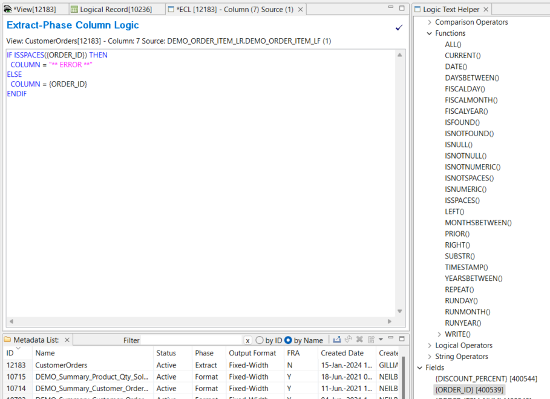
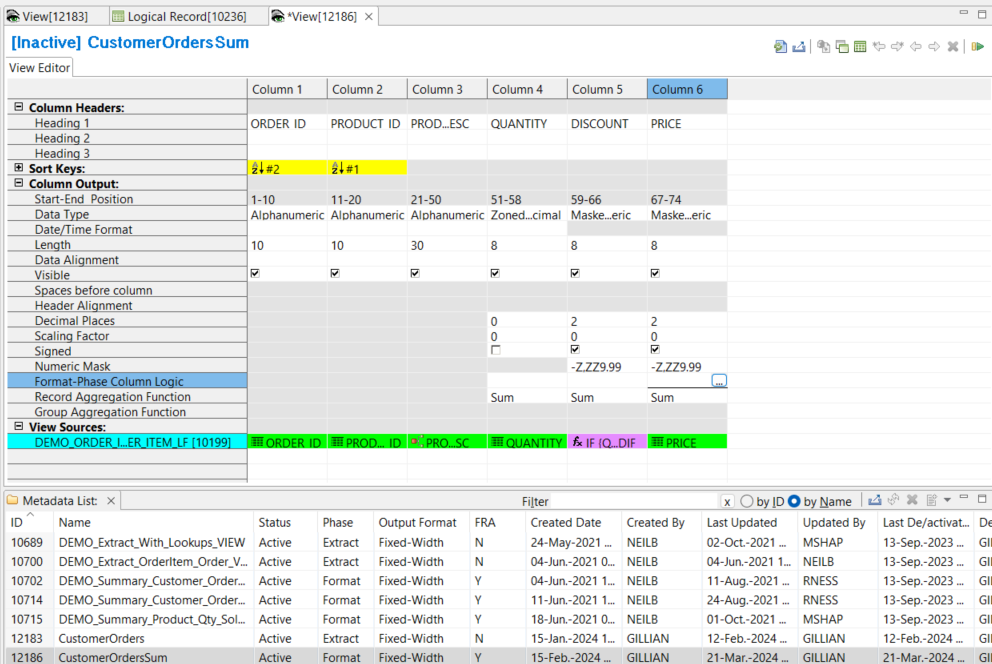

{: .no_toc}
# Column Assignment

{: .no_toc}
TABLE OF CONTENTS 
1. TOC
{:toc}  

## Extract Phase Column Logic

The Extract phase has visibility into all fields on the input LR, and all fields of Lookup Paths that have the input LR as the source LR of the first step of the lookup path.

### Column Assignment - Constants

A constant can be applied to a column.  

1. Click in the column's **View Sources** cell  
  In the Column Source Properties area:
2. Select **Column Source Type** > **Constant** 
3. Type the constant value in **Column Source Value**

An alphanumeric value is entered without single or double quotation marks. If spaces are assigned to the column, they will not be visible in this cell. 

### Column Assignment - Logic

An alternative approach to assigning values to a column is to use column logic. 

1. Click in the column's **View Sources** cell  
  In the Column Source Properties area:
2. Select **Column Source Type** > **Column Logic** 
3. To create and edit the column logic click in **Column Source Value**, then click the icon on the right side .  
This opens the **Extract-Phase Column Logic** tab (**ECL** tab) in the Editor Area.  
  
Opening the **ECL** tab also opens the **Logic Text Helper**, which enables you to place keywords, field names, and column numbers into logic for column assignment.  

A very simple “column equals” statement can be used to assign a constant value to a column. In this example, a constant value of a space is assigned to a column. Constants surrounded with double quotation marks create alphanumeric constants.

    COLUMN = " "

### If Then Else

Column logic can include if-then-else logic as well. The column output will contain the result of the THEN or the ELSE conditions. Nested IFs are also permitted.

In this example, the value of ORDER_TOTAL_AMOUNT or the constant of 0 is written to the output file.

If then else logic can be written several ways. In addition to the typical IF THEN ELSE, a value can be assigned to a column and then a test can be performed to see whether that value should be overwritten.  

Logic statement 1

    IF  {CUSTOMER_ID} > 0 THEN
      COLUMN = {ORDER_TOTAL_AMOUNT}
    ELSE
      COLUMN = 0
    ENDIF  

Logic statement 2   

    COLUMN = 0
    IF  {CUSTOMER_ID} > 0 THEN
      COLUMN = {ORDER_TOTAL_AMOUNT}
    ENDIF

Logic statement 3 

    IF  {CUSTOMER_ID} > 0 THEN
      COLUMN = {ORDER_TOTAL_AMOUNT}
    ENDIF

All three logic statements seem to result in the same output. However, the third statement, without an implicit ELSE condition, is not recommended and may have unpredictable results. The second statement is also less efficient because the assignment is overwritten when the IF condition is true.

### Column Attributes

Column attributes, used to define the output, must be set so that the field values and constants assigned in logic text fit within the column.

For example, the following logic will set the column to field PRICE, a 6-byte packed field. The attributes of the column could be set to 6-byte packed, or 16-byte Masked Numeric, or another numeric data type large enough to hold a 6-byte packed number.

    IF  {DISCOUNT_PERCENT} > 0 THEN
      COLUMN = {PRICE} * (100 - {DISCOUNT_PERCENT} ) / 100
    ELSE
      COLUMN = {PRICE}
    ENDIF

### Functions

In addition to using field names in logic text, you can use functions. This column uses the ISSPACES function, which tests a field value equal to spaces. If true, the output column contains the text “Error”; if not true, it contains the order ID.

See [Extract-Phase Column Logic Reference](../Reference/Workbench/LogicTextECLStatements.md#functions) for detailed descriptions of the functions.

### Value Reassignment

Column logic can be used to assign values to a prior column, which is called reassignment. Column logic is applied to columns starting from the left and moving to the right. Thus columns are populated left to right within GenevaERS, and previously assigned values can be overwritten by later columns.

Within the logic text, COLUMN= assigns a value to the current column, and COL.nn= refers to a prior column, where nn is the column number. Because columns are populated left to right, only prior columns can be referenced within column formulas. This feature does not require the same logic to be repeated in multiple columns; all columns depending upon the logic statement can be assigned within one column.

The following is some example column logic within column 6. It assigns, first, a space to column 6, second, the value XYZ to column 4, and third, asterisks to column 5.

    COLUMN = " "
    COL.4 = "XYZ"
    COL.5 = "***"

### Field Calculations

Column logic allows calculations to be performed against numeric fields. Any calculation referencing a field name is performed at extract time because the Extract phase has visibility into all fields on the input LR.

    COLUMN = {ORDER_TOTAL_AMOUNT} * 0.1

See [Extract-Phase Column Logic Reference](../Reference/Workbench/LogicTextECLStatements.md) for detailed descriptions of the logic.

## Format-Phase Column Logic

The format phase is optional, but if the view has a format phase, column logic can be performed in this phase using column values assigned in the Extract process.  Format phase logic refers to columns rather than field names. The only columns available for format phase column logic are those with a numeric data type (i.e. not alphanumeric).

### Creating Format-Phase Column Logic text

This logic text is part of a view and is associated with a column during the format phase.

1. Open the view by double-clicking the view listed in the Metadata List Area.  
Note that the view must have a format phase for **Format-Phase column logic** to be enabled.
2. Ensure you are on the **View Editor** tab. If the **View Properties** tab is displayed, click the **Show Grid / Properties** button.  or press F9 or select **Edit -\> Show Grid/Properties**.
3. Choose a numeric column that is not part of the sort key. 
4. Format phase column logic is accessed by double-clicking in the **Format-Phase Column Logic** cell, or clicking in the cell, then clicking the icon .  
This opens the **Format-Phase Column Logic** tab (**FCL** tab) in the Editor Area.  
  
Opening the **FCL** tab also opens the **Logic Text Helper**, which enables you to place keywords and column numbers into logic for column assignment.  

The following is some example format phase column logic within column 4. 

    COLUMN = COL.1 - COL.2 - COL.3
  

See [Format-Phase Column Logic Reference](../Reference/Workbench/LogicTextFCLStatements.md) for detailed descriptions of the logic.
