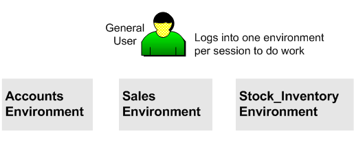

# Workbench Environments

An environment is a logical collection of metadata within the GenevaERS Workbench. The environment data is stored in a database. Typical types of environments are development, production, or training environments. Access to an environment can be restricted to sets of users with different permissions.

An environment can contain items of these types:

-   Control records,
-   Groups,
-   Logical files,
-   Logical records,
-   Lookup paths,
-   Physical files,
-   Users,
-   User-exit routines,
-   Views,
-   View folders.

For more on these metadata items are, look under [Advanced Features](./index.md).

The Workbench installation process defines an initial environment **Development**, and a system administrator user ID.

## Administrating environments

**System administrators define environments**. There may be separate environments for Accounts, Sales, Stock Inventory and so on.

All users of the GenevaERS workbench login to one environment per session.  

A system administrator logs into one environment per session while still retaining some access to all environments at all times.

General users and environment administrators log into one environment per session, and can only access that environment during that session.  

When already logged into the workbench, to change environment or change group for the same environment,  

 click **File** > **Return to login...**, or  
 press **Ctrl + l**

Separate environments provide these benefits:

-   **Access controls** for sensitive data. The most sensitive data can be in an environment with the most restrictive access controls.
-   **Simplify the job of general users** in that environment. For example, general users in the Sales environment are not distracted by other data and can quickly find work done by other users in that environment.
  
## Environments and groups

For environments to be used by general users, the environment must be associated with at least one **group**. A general user gains **access to an environment** by becoming a **member of a group**.

Within groups authorities to access one or more environments can be defined. Group authorities for each environment can be any of the following:

-   **Administrator** access authorities. This allows members of that group to be environment administrators.
-   **General user** access authorities, as follows:
    -   Edit rights to specific items. Example: rights to read/modify/delete a specific logical file.
    -   Create permissions for types of items Example: create views permission.
    -   Run permission for utilities.

One group may have only **read access** to all items in an environment and no create rights. Another group may have **edit rights** to individual items. User rights in an environment are controlled by the group selected during login to that environment.

For more, see [Security Overview](./SecurityOverview.md).

## Using environments

At **login** to the GenevaERS Workbench.  
- All users choose an environment.  
- General users must choose a group.  

  An environment administrator (a general user with administration rights for a particular environment or environments) must choose the group that provides the administrator access rights for that environment.

  Other general users must be a member of the group that gives them Guest or Developer access to the environment they wish to work in.

## Creating and modifying environments

An environment is defined by creating a meta data item in the workbench.

**System administrators** can **create, read, modify and delete** environment records.

**Environment administrators** can **modify** the environment record they have permission to administrate.

