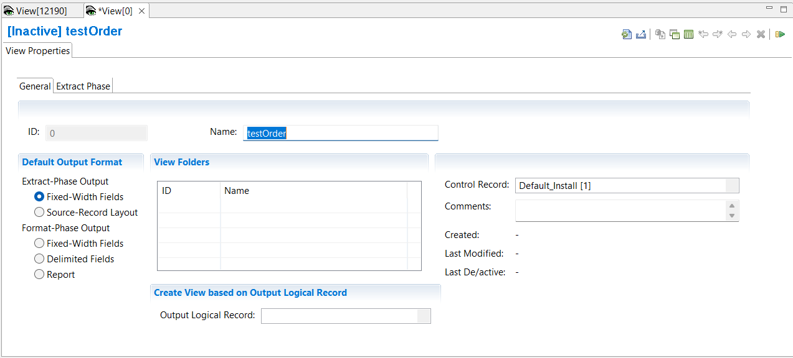

{: .no_toc}
# Create Extract-only view with fixed-width fields

TABLE OF CONTENTS 
1. TOC
{:toc}  

Creating an Extract-Phase Output view is described here.  

### Define view

To create a new view:

1. Select **Administration** > **New** > **View** from the menu.  



The first screen presented is the View Properties screen, which contains the sub-tab **General**.

1. In the **Name** field  type a descriptive name.
2. In the **Control Record** field select the control record.
3. Select the **Default Output Format** required. This will affect the other sub-tabs available to you. For this case, an Extract only view with column defined output, select **Extract-Phase Output** > **Fixed-Width Fields**.
4. You can select an output LR to pre-define columns by using **Create View based on Output Logical Record**.  This option is only available before the first save. It could be useful if the output of this view is to become the source of another view via a pipe or a token.

5. Select the **View Properties** sub-tab **Extract Phase**. Here you have the option to limit the number of output records written with the **Extract-Phase Output Limit**
6. Save the view **File** > **Save**  

When you save a new view, the view ID is assigned by the Workbench and is not editable.

<!-- View Source specification description -->
 

<!-- COLUMN specification description -->
  

13. You can add as many columns as you want, but be aware of the output record length. Each column displays the start and end position in the output record.

<!-- Output destinations description -->
  

### Define a filter

The view can contain logic to filter input records at extract-phase time.  See [overview of record filters](../OverviewRecordFilters.md) and [create record filters](./CreateRecordFilters.md).

<!-- Activate view description -->
  
