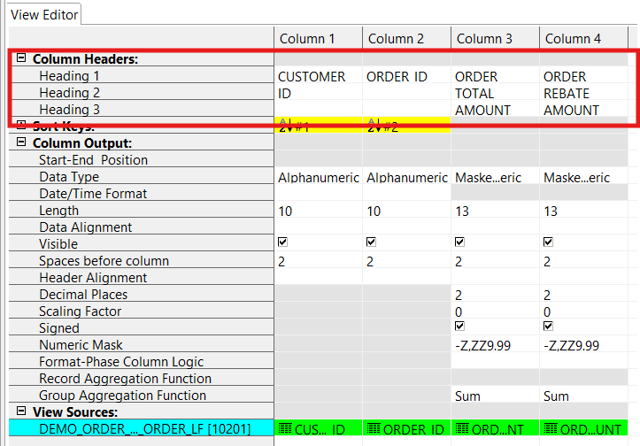
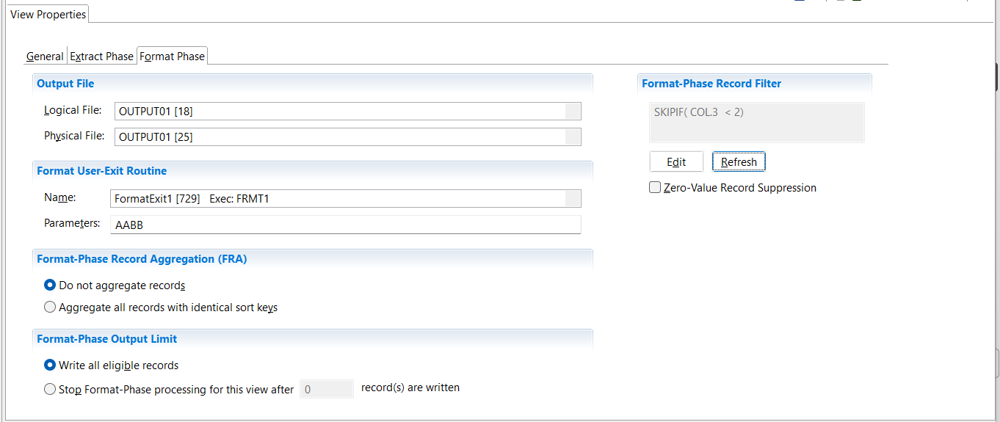

{: .no_toc}
# Create a Detailed Report

TABLE OF CONTENTS 
1. TOC
{:toc}  

## Detailed report styles

Detailed Reports can have: 
- page sizes configured with user defined headers and footers.  

The data can be displayed:
- in columns with user defined column headers, or 
- displayed with the sort keys as labels and the data indented - categorized format, or
- a combination of columns and categories.  

Subtotals:  
- Subtotals of some or all sort keys can be included through out the report.
- Grand totals can be included at the end.

## Create a detailed report

To define a view that will write all records, sorted, in a report style: 

### Add new view definition

1. Select **Administration** > **New** > **View** from the menu.  



The first screen presented is the View Properties screen, which contains the sub-tab **General**.

1. In the **Name** field  type a descriptive name.
2. In the **Control Record** field select the control record.
3. Select the **Default Output Format** required. This will affect the other sub-tabs available to you. For this case, a summary view with report style output, select **Format-Phase Output** > **Report**.
4. You can select an output LR to pre-define columns by using **Create View based on Output Logical Record**.  This option is only available before the first save. It could be useful if the output of this view is to become the source of another view via a pipe or a token.  
5. Select the **View Properties** sub-tab **Format Phase**, and click   
**Format-Phase Record Aggregation (FRA)** > **Do not aggregate records**.  
Note: This is the default setting.  
6. Save the view **File** > **Save**  
When you save a new view, the view ID is assigned by the Workbench and is not editable.

Choosing the output format option as Report makes the sub-tab **Report** available, as well as the **Extract Phase** and **Format Phase** sub-tabs. Options available on all these sub-tabs are described in the sections below.

To define the report page size and customize page headers and footers, go to the **Report** sub-tab.

<!-- Report tab description -->
  

<!-- View Source specification description -->
 

<!-- COLUMN specification description -->
  

#### Column headings

The column headings that are used in reports are specified on the **View Editor** tab. For column types Source File Field and Lookup Field, the column heading value defaults to the heading value in the logical record. If there is no heading value in the logical record, the field name is used. You can over type this value as needed. You can split a long column heading over the three heading cells Heading 1, Heading 2 and Heading 3.  

<!-- Sort key specification description -->
  

### Report style options - Columns 

The simplest report contains the sort fields displayed as data in columns, and includes no subtotals. To produce a report that is formatted to display information as data and to have no sort key footer, 

1. Select the **View Editor** tab. 
2. Open the **Sort Key Properties** frame by clicking on the yellow **Sort Keys** cell in the column grid.
3.  Select **As Data** for the **Display Mode**. This indicates the sort key data to be displayed in a column.
4.  Select **Suppress Print** for the **Sort Key Footer Option**. This indicates no subtotal to be displayed at the sort key break (change in sort key value).  

If all sort keys have these same parameters, the report will look much like a spreadsheet with columns and rows of data.

### Report style options - Categories

As an alternative to displaying sort key values “as data” (that is, in columnar format), you can display sort key values on the left side of the page, with indentation, and group records with the same sort key values together. This is known as the “categorized” format.

1. Select the **View Editor** tab. 
2. Open the **Sort Key Properties** frame by clicking on the yellow **Sort Keys** cell in the column grid.
3.  Select **Categorize** for the **Display Mode**. This indicates the sort key data to be displayed as categories.
4.  The **Sort Key Label** defaults to the text in Heading 1 for the Sort Key. This can be edited.

### Report style options - Mixed

### Report style options - Subtotals

You can opt to print subtotals for numeric columns, at each sort break (change in sort key value). You can choose to define this for one or many of the defined sort keys. For example, you may want to print the subtotals for the primary sort key, but not the secondary sort key.  

The value to be placed in this subtotal field is determined by the group aggregation functions, for the numeric columns. 

1. Select the **View Editor** tab. 
2. Open the **Sort Key Properties** frame by clicking on the yellow **Sort Keys** cell in the column grid.
3. Select **Print** for the **Sort Key Footer Option**. This indicates subtotals are to be displayed for numeric fields, at the break (change in sort key value) for this sort key.
4. The subtotals will be prefaced with the value in the **Sort Key Footer Label** field. The default is "Subtotal," but this can be edited.

The value to be placed in the subtotal field is determined by the group aggregation function, for the numeric column.  You can specify the type of aggregation for each numeric column: Group Calculation, Maximum, Minimum, Sum (default).

To specify the type of subtotaling, double-click in the **Group Aggregation Function** cell for the column, and select the function from the drop-down list.

- **Maximum** returns the maximum column value for each unique sort key value.  
- **Minimum** returns the minimum column value for each unique sort key value.  
- **Sum** returns the sum of the column values for each unique sort key value. Any Format-Phase Column Logic is performed before aggregation i.e. on every extract record.  

Note that the cell will be grey, and can not be selected, if the column is data type Alphanumeric, the column is a sort key, or there is no format phase defined.

<!-- Format-Phase column logic description -->
  

<!-- Output destinations description -->
  

<!-- Define filters links -->
  

### Defining sort key titles
???

### Extract Phase tab options

1) You have the option to limit the number of output records written with the **Extract-Phase Output Limit**.  
- Select **Write all eligible records** to ensure that all eligible records are output. This button is selected by default.  
- Select **Stop Extract-Phase processing for this view after *n* records are written** to stop the processing of this view after *n* records are written. The *n* value is a positive integer up to 9 digits. The default for the *n* value is 100.

2) **File Number** is used to manage the intermediate extract file name. See [Output destinations](#Output-destinations) for more details. The default is 0.

### Additional Format Phase tab options

Select the **View Properties** sub-tab **Format Phase**.  

  

The **Output File** option is described in [Output destinations](#Output-destinations) above.

You have the option to specify a **User-Exit routine** to be called during the format phase:
- Select **Format User-Exit Routine** > **Name**  
Select a User-Exit Routine from the drop down list. All the routines
are of type Format. Sort the list by clicking on "id" or "name" in the header of the list. Reverse the sort order by clicking again on "id" or "name" in the header. 
- Select **Parameters** to specify input data for the user-exit routine. This can be up to 32 characters.

You have the option to limit the number of output records written with the **Format-Phase Output Limit**.
- Select **Write all eligible records** to ensure that all eligible records are output. This button is selected by default.  
- Select **Stop Format-Phase processing for this view after *n* records are written** to stop the processing of this view after *n* records are written. The *n* value is a positive integer up to 9 digits. The default for the *n* value is 100.

The **Format-Phase Record Filter** option is described in [Define filters](#Define-filters) above.

To avoid output of records with zero in all numeric fields, tick the **Zero-value Record Suppression** box.

<!-- Activate view description -->
  
