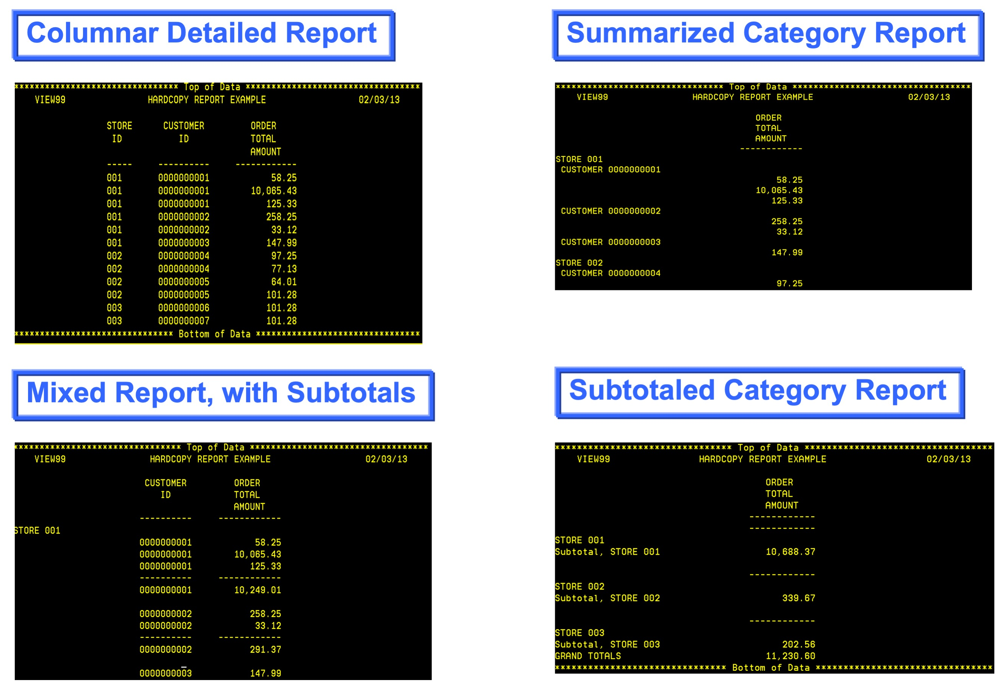

{: .no_toc}
# Create a Detailed Report

TABLE OF CONTENTS 
1. TOC
{:toc}  

## Detailed report styles

Detailed Reports can have: 
- page sizes configured with user defined headers and footers.  

The data can be displayed:
- in columns with user defined column headers, or 
- displayed with the sort keys as labels and the data indented - categorized format, or
- a combination of columns and categories.  

Subtotals:  
- Subtotals of some or all sort keys can be included through out the report.
- Grand totals can be included at the end.

## Create a detailed report

To define a view that will write all records, sorted, in a report style: 

### Add new view definition

1. Select **Administration** > **New** > **View** from the menu.  



The first screen presented is the View Properties screen, which contains the sub-tab **General**.

1. In the **Name** field  type a descriptive name.
2. In the **Control Record** field select the control record.
3. Select the **Default Output Format** required. This will affect the other sub-tabs available to you. For this case, a summary view with report style output, select **Format-Phase Output** > **Report**.
4. You can select an output LR to pre-define columns by using **Create View based on Output Logical Record**.  This option is only available before the first save. It could be useful if the output of this view is to become the source of another view via a pipe or a token.  
5. Select the **View Properties** sub-tab **Format Phase**, and click   
**Format-Phase Record Aggregation (FRA)** > **Do not aggregate records**.  
Note: This is the default setting.  
6. Save the view **File** > **Save**  
When you save a new view, the view ID is assigned by the Workbench and is not editable.

Choosing the output format option as Report makes the sub-tab **Report** available, as well as the **Extract Phase** and **Format Phase** sub-tabs. Options available on all these sub-tabs are described in the sections below.

To define the report page size and customize page headers and footers, go to the **Report** sub-tab.

<!-- Report tab description -->
  

<!-- View Source specification description -->
 

<!-- COLUMN specification description -->
  

<!-- COLUMN header specification description -->
  

<!-- Sort key specification description -->
 

<!-- Report Types description -->
  

<!-- Format-Phase column logic description -->
  

<!-- Output destinations description -->
  

<!-- Define filters links -->
  

### Defining sort key titles

The sort key titles functionality allows for descriptions to be placed next to sort keys by doing a lookup in a reference file. These are useful when sorting by codes, such as customer or store IDs. 

To define a Sort Key Title  
1. Select the **View Editor** tab. 
2. Open the **Sort Key Properties** frame by clicking on the yellow **Sort Keys** cell in the column grid.  
A tab **Sort Key Title** opens up in the bottom panel.  
3. On the Sort Key Title tab,  
 - select the logical record from the **View Source** list.
 - select the field from the **Title Field** list. This will list all the available fields from currently defined lookup paths for this source LR.
 - If the Lookup path selected has effective dates
 - Select from the **Effective Date Type** list
 - Enter the **Effective Date Value**
6. Adjust the length of the **Title field** to be shown on the report. 

### Extract Phase tab options

1. You have the option to limit the number of output records written with the **Extract-Phase Output Limit**.  
- Select **Write all eligible records** to ensure that all eligible records are output. This button is selected by default.  
- Select **Stop Extract-Phase processing for this view after *n* records are written** to stop the processing of this view after *n* records are written. The *n* value is a positive integer up to 9 digits. The default for the *n* value is 100.

2. **File Number** is used to manage the intermediate extract file name. See [Output destinations](#Output-destinations) for more details. The default is 0.

### Additional Format Phase tab options

Select the **View Properties** sub-tab **Format Phase**.  

  

The **Output File** option is described in [Output destinations](#Output-destinations) above.

You have the option to specify a **User-Exit routine** to be called during the format phase:
- Select **Format User-Exit Routine** > **Name**  
Select a User-Exit Routine from the drop down list. All the routines
are of type Format. Sort the list by clicking on "id" or "name" in the header of the list. Reverse the sort order by clicking again on "id" or "name" in the header. 
- Select **Parameters** to specify input data for the user-exit routine. This can be up to 32 characters.

You have the option to limit the number of output records written with the **Format-Phase Output Limit**.
- Select **Write all eligible records** to ensure that all eligible records are output. This button is selected by default.  
- Select **Stop Format-Phase processing for this view after *n* records are written** to stop the processing of this view after *n* records are written. The *n* value is a positive integer up to 9 digits. The default for the *n* value is 100.

The **Format-Phase Record Filter** option is described in [Define filters](#Define-filters) above.

To avoid output of records with zero in all numeric fields, tick the **Zero-value Record Suppression** box.

<!-- Activate view description -->
  
