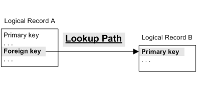
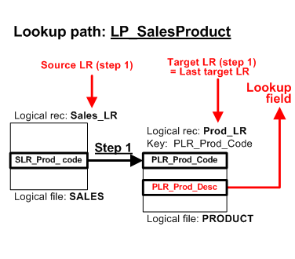
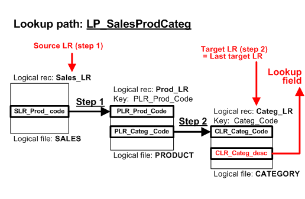
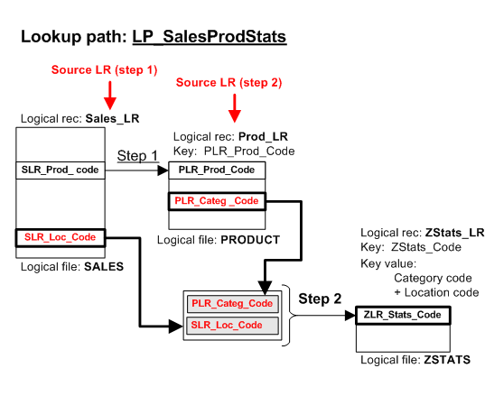
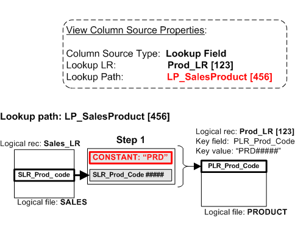
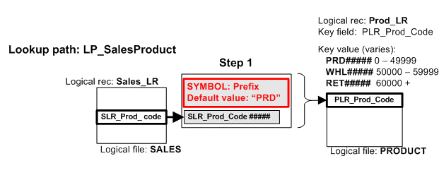
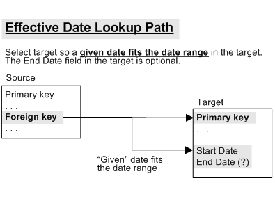
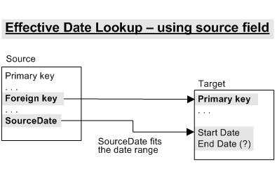

{: .no_toc}
# Lookup Paths Overview

TABLE OF CONTENTS 
1. TOC
{:toc}  

## What is a lookup path?

GenevaERS allows users to combine data, or "lookup" data from different files for selection tests or inclusion in an output. This requires telling GenevaERS which data from the two files to match, the source, and the target. These files typically have different layouts, described by differing GenevaERS logical records, or LRs. GenevaERS requires these source and target relationships to be predefined in a GenevaERS lookup path. The lookup path has a similar function to an SQL "where" clause in a relational database.

A field in record A is a "foreign key" that can access record B
where that field is defined as a "primary key". The field in record A now gives access to all the information in record B. This is a single-step lookup path. A lookup path can be defined with multiple steps. See [Multi-step lookup paths](#multi-step-lookup-paths) for more information on these.

Consider an example: for each sales transaction we need to know the product description.

In this example, use the lookup path **LP\_SalesProduct**.

Note the following:

- This lookup path has one step. 
- The step has a **source** logical record, **Sales_LR**, and a **target** logical record, **Prod_LR**.
- There must be a **primary key** defined for the target logical record, in this example that is **PLR_Prod_Code**.
- The field required is **PLR\_Prod\_Desc** and this is known as the **lookup field**. Any field in the target logical record can be a lookup field.

## Building lookup keys

The primary key used to access the target LR can be made up of several components, it is not restricted to the foreign key from the source LR.

The key could include:

-   A field in the source logical record \(for example the "foreign key" might be all you need\).
-   Multiple fields in the source logical record, when a primary key may be a combination of fields.
-   A constant - see section [Constant in a lookup path step](#constant-in-a-lookup-path).
-   A symbol - see section [Symbol in a lookup path step](#symbol-in-a-lookup-path).
   
## Multi-step lookup paths

A lookup can have more than one step that allows access to more logical records in a single lookup path.

In the example below, for each sales transaction we need to know the product category description.

Here we use the lookup path **LP\_SalesProdCateg**.

The **steps** are as follows:

1.  Use **SLR\_Prod\_code** to access the **Prod\_LR** logical record.
2.  Use **PLR\_Categ\_code** to access the **Categ\_LR** logical record.

### Use fields from the current and previous steps

Each step in a lookup path must have a primary key. The primary key can use:

-   Fields in the source logical record for the current step, and
-   Fields in the source logical records for previous steps.  
Also,  
-   Constants - see section [Constant in a lookup path step](#constant-in-a-lookup-path).
-   Symbols - see section [Symbol in a lookup path step](#symbol-in-a-lookup-path).

In the example below, step 2 uses fields from step 1 and 2.

## Constant in a lookup path

Each step of a lookup path creates the primary key to a target logical record. That primary key may contain a constant value.

In the example below, lookup path **LP\_SalesProduct** uses a constant. The primary key to Prod\_LR consists of "PRD" followed by 5 digits. The lookup path use a constant for the "PRD" and the 5 digits come from field **SLR\_Prod\_code**:

## Symbol in a lookup path

A symbol allows a value to be set in the view when the lookup path is used.

A symbol value has a default value in the lookup path, so you only need to change the symbol for exceptions. If the symbol always uses the default value, then the symbol is effectively a constant.

In this example below a symbol is used to change the first 3 characters of the key, and the remaining 5 characters are taken from the source LR.

-   For products from 00001 to 49999, the primary key is "PRD\#\#\#\#\#".
-   For products from 50000-59999, the primary key is "WHL\#\#\#\#\#" \(where WHL is for wholesale\).
-   For products from 60000 onwards, the primary key is "RET\#\#\#\#\#" \(where RET is for retail\).

"PRD" is default value, and this is changed to "WHL" or "RET" if the product is in the appropriate range of numbers.

The symbol can only be changed from the default value using logic text. See the logic text reference: [Lookup paths in logic text.](../Reference/Workbench/LogicText/LookupPaths.md)  
This means the symbol can only be changed from the default value in:
- [Extract-phase column logic](../Reference/Workbench/LogicTextECLStatements.md)
- [Extract-phase record filters](../Reference/Workbench/LogicTextERFStatements.md)
- [Extract-phase record logic](../Reference/Workbench/LogicTextERLStatements.md)

Note that a lookup path can only be called from logic text in the extract phase.

A symbol **always uses the default value** in:

- A lookup from a Column Lookup Field
- A lookup from a Sort Key Title (this is in the format phase)

To set a symbol to a non-default value in logic text, the syntax requires **$** \(a dollar sign\) before the symbol name. The actual symbol name always starts with a letter.

Lookup path LP\_SalesProduct uses a **symbol called Prefix** which has a default value of "PRD". In Extract-Phase Column Assignment logic text, the call to LKProduct is different depending on the value of the 5 digits. This is shown below:

  

Extract-Phase Column Logic text for a column in a view:

    IF {SLR_Product_Code} < 50000
        THEN COLUMN = { LP_SalesProduct.PLR_Prod_Desc }
        ELSE IF {SLR_Product_Code} < 60000
            THEN COLUMN = { LP_SalesProduct.PLR_Prod_Desc; $Prefix="WHL" }
            ELSE COLUMN = { LP_SalesProduct.PLR_Prod_Desc; $Prefix="RET" }
        ENDIF
    ENDIF   

Notice how the first call to LP\_SalesProduct does not give a value for symbol Prefix so the default value of "PRD" applies.

## Effective dates in lookup paths

An effective date lookup means the lookup finds a target logical record with the correct key and the correct date.

Changes in reference data can be maintained to allow for the recreation of reports as of a point in time. This can be done in individual views or a view might include multiple “as of” dates.

An effective date lookup needs the following:

-  The target logical record to have a **date range**.

    This date range exists if at least one date field in the target logical record is marked **Start date**. Optionally, the record can also have a date field marked **End date**. These two dates **cannot** be part of the primary key of that logical record.

-  The view to supply a **given date**. The given date selects a target logical record by date.

    The **given date** can be one of:

    -  A **field** in the **source** logical record,
    -  The **run date** for that run of the Performance Engine,
    -  A **constant** value given in the view or logic text calling the lookup path.

### Effective date using source field

### Effective date using run date

### Effective date using constant

The "given" date is a constant date value given in a view or logic text. A constant date value is specified as follows:

-   Screen "**Column Source Properties**" in field "**Effective Date Value**".
-   Screen "**Sort Key Titles**" in field "**Effective Date Value**".
-   In **Extract-Phase Column logic** text, which includes a **DATE** keyword for specifying a date constant.
-   In **Extract-Phase Record Filter** logic text, which includes a **DATE** keyword for specifying a date constant.
-   In **Extract-Phase Record logic** text, which includes a **DATE** keyword for specifying a date constant.

## Define lookup paths

Lookup paths are defined using metadata in the GenevaERS Workbench. Go to [Create Lookup Paths](../AdvancedFeatures/MetaData/CreateLookupPath.md) for detailed information on how to do this.

## Where to call lookup paths in a view

You can call a lookup path from four locations:

- A view column as a Lookup Field, or in Extract-Phase Column Logic text.
- In an extract-phase filter, in Extract-Phase Record Filter logic text.
- At extract-phase output writing time, in Extract-Phase Record logic text.
- A Sort Key Title in the format phase.
