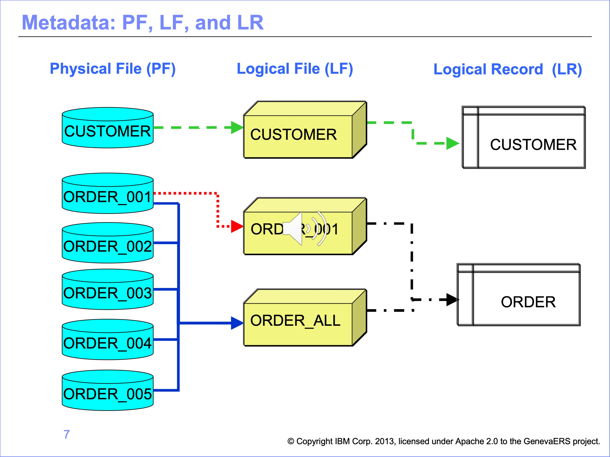
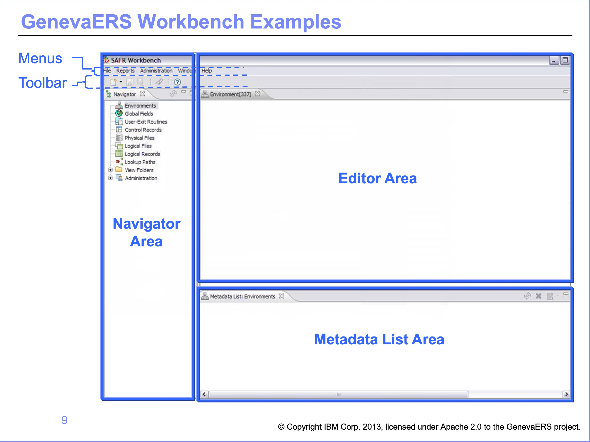

## Configure GenevaERS to do things

The Workbench is how you tell GenevaERS what needs to be done.

Like most things in IT, it is a matter of:
1.  Define inputs
2.  Define processing
3.  Define outputs

A collection of the three points above is called a "**view**".  A view shows what your requested processing for GenevaERS.

Running GenevaERS is a matter of preparing views in the Workbench and then running the views in the Performance Engine. 

The Performance Engine is the part of GenevaERS that actually produces the results.

## Metadata
Begin by using the Workbench to define metadata. The most common are 
- the environment definition, 
- the physical file definition (or PF), 
- the logical file definition (or LF), 
- the logical record definition (or LR), 
- the view definition, and the view folder.  

Note that, when discussing GenevaERS metadata, we often omit the word definition, because it is usually clear from the context whether we mean the metadata or the entity it refers to.  

An environment definition describes a logical collection of metadata within the GenevaERS Workbench. Typical types of environments include development, production, or training environments. Access to an environment can be restricted to a certain set of users.  

Some major components of the metadata include:
- A physical file definition, or PF, describes a data source. Examples include a customer file in a Db2 database, or an order file in a sequential file. 

- A logical file definition, or LF, describes a collection of one or more physical files. 

- A logical record definition, or LR, describes a record layout. In COBOL programs, record layouts are often found in copybooks. In relational databases, they are found in table definitions.

Some examples of these metadata types are shown here. 

 

- A logical record for a customer is used to map data to a customer logical file. The customer logical file refers to data in a customer physical file.  
- An order logical record is used to map data from a logical file named ORDER_001, which refers to data in a single physical file named ORDER_001.  
- The order logical record can also be used to map data from a logical file named ORDER_ALL. ORDER ALL refers to a collection of order physical files.

## Views

A view definition describes a data transformation. It is analogous to a program or a query. Views are the basic units of work that are performed by the Performance Engine.  

Views are often grouped together into view folders for ease of maintenance. View folders are often named for a particular developer or function. Security can be applied to view folders to prevent unauthorized access.  

## Workbench

The GenevaERS Workbench is used to add, change, and delete GenevaERS metadata. 
 

It contains a menu and toolbar, and consists of multiple display areas, or frames.  

- The Navigator area displays the types of metadata available.  

- The Metadata List area displays a list of items for the selected metadata type.  

- And the Editor area is the part of the screen where you modify metadata items.
