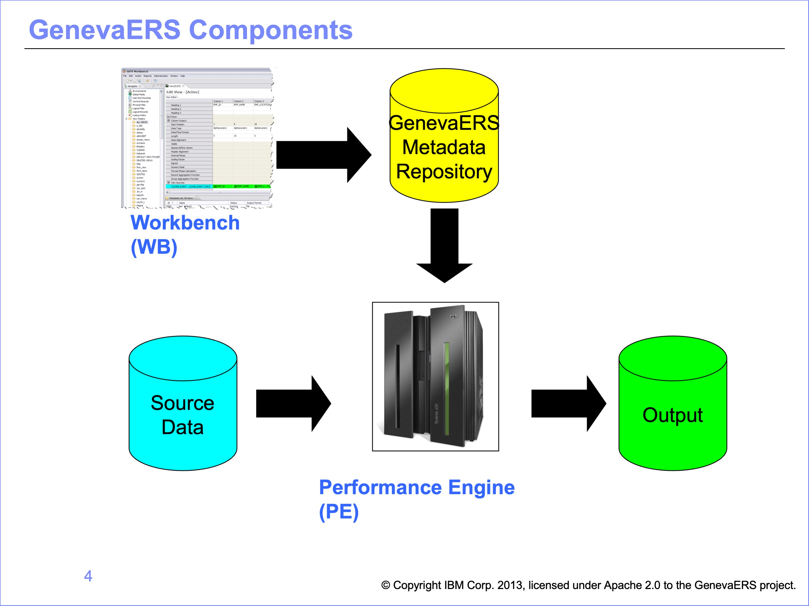

# Get Started

## Overview 
GenevaERS is open source software that
- executes high-volume data analysis very efficiently
- is easy to use, with a graphical interface
  
## Overview of Components
GenevaERS consists of two software components: the PC-based Workbench and the mainframe-based batch process known as the Performance Engine. Developers use the Workbench to build applications that are stored in a metadata repository. These applications are then run by the Performance Engine, which reads data from source files or databases, transforms it, and writes it to output files.
Examples of source data are:
- z/OS sequential files
- Db2 database
- VSAM files
- Adabas database
  
GenevaERS rapidly produces many outputs while efficiently reading large volumes of data only once.

GenevaERS is extensible, and adding more reports or outputs does not affect the performance. 

## Basic Concepts

The following information provides you with a broad overview of GenevaERS and the basics of its graphical user interface. 

[Workbench Introduction](Concepts/Intro0_Introduction_to_Using_GenevaERS.md)

The following page provides you with an introduction to the GenevaERS Performance Engine and how to use it.  You will be able to:
- Identify the phases of the Performance Engine 
- Identify the main inputs and outputs for each phase

[Performance Engine Introduction](Concepts/Intro1_Introduction_to_the_Performance_Engine.md)

  
## Demo
Download and run a demo of GenevaERS. Follow this link to the  
[GenevaERS Demo Documentation](https://genevaers.github.io/Demo/)

