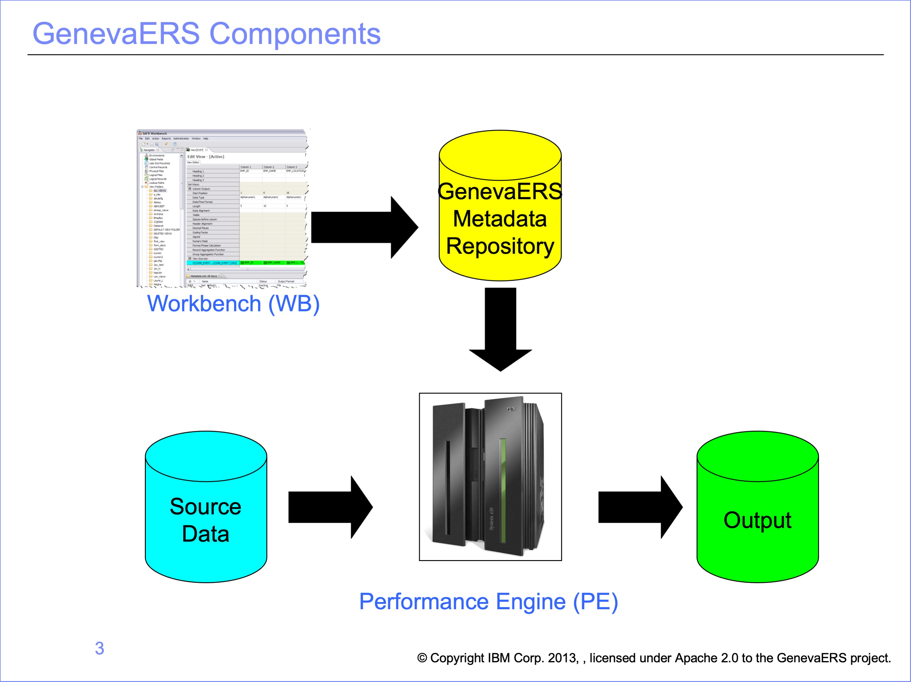

# Introduction to the GenevaERS Performance Engine

# GenevaERS Overview

 

GenevaERS consists of two software components: a PC-based Workbench and a mainframe-based batch process known as the Performance Engine. Developers use the Workbench to build applications that are stored in a metadata repository in a database. These applications are then executed by the Performance Engine, which reads data from source files or databases, transforms it, and writes it to output files. In this sense, GenevaERS is an application development tool and is not fundamentally different from any other tool or language. 

# Performance Engine Phases

The Performance Engine comprises four phases: 
- The COMPILE phase, where selected views are converted to an executable form, and logic from multiple views is consolidated and optimized for execution
- The REFERENCE phase, where values are retrieved from lookup tables and optimized for execution
- The EXTRACT phase, where data from source files is retrieved, merged with lookup data, and transformed for output, and
- The optional FORMAT phase, where data is sorted, summarized, and formatted if necessary 
