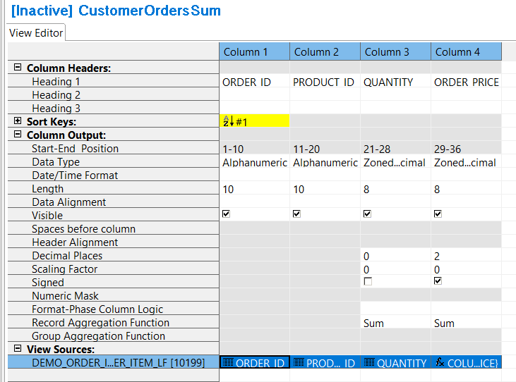
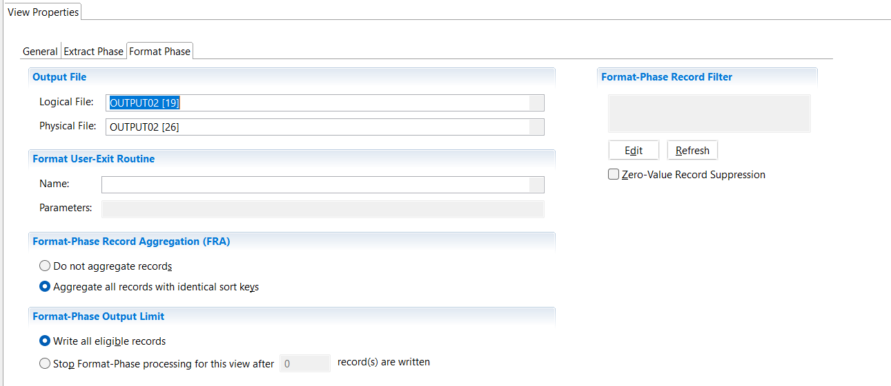

## Example 5: Creating a summary view

In this example you will create a view that reads the order item files, then calculates the total number of products per order and the total price of the order. This view requires a format phase to be defined, which will do the summarisation. For this example you will copy and modify the view created in [Example 1](./NewView.md).

1. Open the **CustomerOrders** view by double-clicking the view listed in the Metadata List Area
2. Select **File** > **Save As** 
3. In the **New Name** field type **CustomerOrdersSum**, and click **Save**

---
   View information is displayed on two separate screens:

   The **View Properties** screen, where you can modify information that applies to the whole view.  
   The **View Editor** screen, where you can define specific data transformations.

   To toggle between the View Properties screen and the View Editor screen,  
   - press **F9**,  
   - or click the **Show Grid / Properties** button in the Editor area toolbar.

---  

This view will aggregate records for each order, so records must be sorted by the order ID. The format phase does the sorting and aggregating, and requires a **sort key** to be defined. 

Modify the view to include a format phase with aggregation.

1. Toggle to the View Properties screen.
2. On the **General** tab click **Format-Phase Output** with **Fixed-Width Fields** (under **Default Output Format**).   
A new tab will appear labelled **Format Phase**
1. On the **Format Phase** tab click **Aggregate all records with identical sort keys** (under Format-Phase Record Aggregation (FRA)).

Define the ORDER_ID as the sort key.

1. Toggle to the View Editor screen.
2. Select the column with the column source **ORDER_ID**
3. Select **Edit** > **Make Sort Key**
4. Save the view **File** > **Save**   

Define the columns.

Delete the PRODUCT_DESC column and the DISCOUNT column, if they have been added previously from Example 3 and Example 4.

1. Select the column with the column source **PRODUCT_DESC**
2. Select **Edit** > **Delete**
3. Repeat for the column **DISCOUNT**

Add ORDER_PRICE column

1. Select the last column by clicking on the column header.
2. Select **Edit** > **Insert Column After**  
or insert a new column using the buttons in View Editor toolbar.  
3. Click the green cell at the bottom of the new column.  
The Column Source Properties frame opens on the right.  
4.  From the **Column Source Type** list, select **Column Logic**
5.  To create and edit the column logic click in **Column Source Value**, click the icon on the right side .   
This opens the **Extract-Phase Column Logic** tab (**ECL** tab) in the Editor Area.  
  
Opening the **ECL** tab also opens the **Logic Text Helper**, which enables you to place keywords, field names, and column numbers into logic for column assignment.

6. Add the following logic. 

      COLUMN = {QUANTITY} * {PRICE}

7. Save the Column Logic **File** > **Save**.
8. Close the **Extract-Phase Column Logic** tab.

Change the Data Type to Zoned Decimal with Length 8. All the following applies to the column just added:
9. Click on the **Data Type** cell, and select **Zoned Decimal** from the list. 
10. Click on the **Length** cell, and type **8** 
11. Click on the **Decimal Places** cell, and type **2** 
12. Click the **Signed** cell to indicate signed
13. Click on the **Header 1** cell for this column, and type **ORDER_PRICE** 
14. Save the view **File** > **Save**

Notice that the **Record Aggregation Function** cell has changed to **Sum** for the numeric columns.

### Adding Output destination

Summary views have two phases - the extract phase and the format phase. The extract phase writes to an extract file with DD **EXTRnnn** where **nnn** is the extract phase file number.  
See **View Properties** tab > **Extract Phase** tab > **File Number**. 

The default output destination for the format phase is the DD **F*****nnnnnnn*** where ***nnnnnnn*** is the view ID. For example, if the view ID is **12183** the default DD name for the format phase is **F0012183**.

You can specify your own output destination. To do this for a Format-Phase view:

1. Toggle to the **View Properties** screen.
2. Select the **Format Phase** tab.
2. From the **Output File** > **Logical File** list select **OUTPUT02**
3. From the **Output File** > **Physical File** list select **OUTPUT02**
4. Save the view **File** > **Save**

For more information on how to define your own logical file and physical file definitions look at [Create LR, LF, and PF metatdata](../../AdvancedFeatures/MetaData/CreateLRLFPFs.md) in Advanced Features.

### Activate the View 

To activate the view, use any of these methods: 
- Select  **Action** > **Activate** 
- Press the Activate icon on the View Editor toolbar 
- Press **F5**

The view title bar now displays the word "Active". Save the view again to preserve this active state. The view is now ready to be run.

[Running the View](../RunView/RunView.md)

For more information on summary views see [Introduction to the Summary Phase](Intro4_Introduction_to_Format_Phase.md) and [Introduction to Reports](Intro9_Hardcopy_Output.md)
