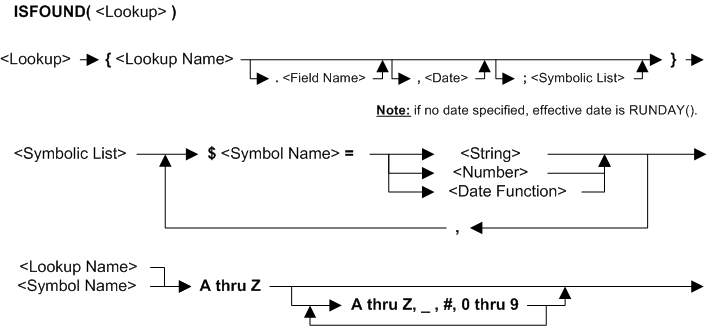

---
layout: default
title: "Function ISFOUND"
parent: Functions
grand_parent: Workbench Logic Text Full Details
nav_order: 10
---
# Function ISFOUND
{: .no_toc}
TABLE OF CONTENTS 
1. TOC
{:toc}  

# How do I use ISFOUND? 

If you provide a lookup path then ISFOUND returns true if the lookup path is successful for the current input record, and false if the lookup path fails.

ISFOUND can only be used in **Extract Record Filter (ERF)** and **Extract Column Assignment (ECA)** logic text.

# Syntax 

# Rules for the syntax 

ISFOUND can only be used in **Extract Record Filter (ERF)** and **Extract Column Assignment(ECA)** logic text.

If **no effective date** is specified, ISFOUND uses RUNDAY\( \) - see topic: [Syntax - function RUNDAY](Syntax - function RUNDAY)

See also topic: [Rules for all Logic Text](../Rules for all Logic Text) 

# Examples: ISFOUND function in ERF 

|Example logic text|Meaning|
|------------------|-------|
|**IF ISFOUND({Lookup2}) &nbsp;&nbsp;&nbsp;&nbsp;THEN SELECT ENDIF**|Select all input records where lookup path Lookup2 successfully finds a target record, and skip all other records. This example is the same as: &nbsp;&nbsp;&nbsp;&nbsp;**SELECTIF(ISFOUND({Lookup2}))**|

# Examples: ISFOUND function in ECA 

|Example logic text|Meaning|
|------------------|-------|
|**IF ISFOUND({Lookup2}) &nbsp;&nbsp;&nbsp;&nbsp;THEN COLUMN = {Lookup2} &nbsp;&nbsp;&nbsp;&nbsp;ELSE COLUMN = " " ENDIF**|If the lookup path Lookup2 uses the current record to successfully find a target record, then set the current column to the lookup field, otherwise set the current column to blank.|

  
  (Examples can be copied to the clipboard.)
  

