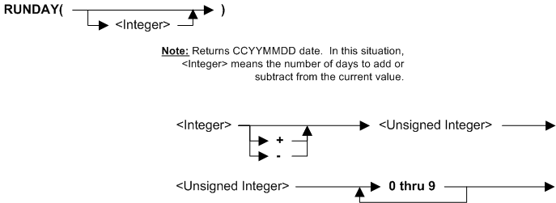

---
layout: default
title: "Function RUNDAY"
parent: Functions
grand_parent: Workbench Logic Text Full Details
nav_order: 22
---
# Function RUNDAY
{: .no_toc}
TABLE OF CONTENTS 
1. TOC
{:toc}  

# What is RUNDAY?

Normally, the date PE runs is the "run date".

The run date can be set to a fixed value in the VDP. See the next section for details of possible values.

RUNDAY returns a CCYYMMDD format date based on the run date. All views in the batch use the same base date for RUNDAY.

# Possible values of the VDP run date

The date that PE runs is the VDP run date unless there is a specific value set in the VDP.  To set a specific value in the VDP see the RUNDATE parameter for the configuration file to MR91 as given in topic [Runbook - MR91 Control File Generator](../../PE Programs/Runbook - MR91 Control File Generator). 

# How do I use RUNDAY? 

The parameter for RUNDAY is a number of days to add or delete from the default RUNDAY. For example, RUNDAY\(-5\) provides the day five days before the date the view is run.

RUNDAY can only be used in **Extract Record Filter** or **Extract Column Assignment** logic text.

# Syntax 

# Rules for the syntax 

The parameter for RUNDAY is a number of days to add or delete from the default RUNDAY. For example, RUNDAY\(-5\) provides the day five days before the date the view is run.

RUNDAY can only be used in **Extract Record Filter** or **Extract Column Assignment** logic text.

See also topic: [Rules for all Logic Text](../Rules for all Logic Text) 

# Examples: RUNDAY function in Extract Record Filter 

|Example logic text|Meaning|
|------------------|-------|
|**IF ({field1} < RUNDAY(-7)) &nbsp;&nbsp;&nbsp;&nbsp;THEN SKIP ENDIF**|Skip any input records where field1 is more than 7 days before the date of running this view, and select all other records. This example assumes that field1 is a date. The code at left can also be written as: &nbsp;&nbsp;&nbsp;&nbsp;**SKIPIF({field1} < RUNDAY(-7))**|

# Examples: RUNDAY function in Extract Column Assignment 

|Example logic text|Meaning|
|------------------|-------|
|**COLUMN = RUNDAY()**|Set current column to the same day number as the view is run.|

  
  (Examples can be copied to the clipboard.)
  

