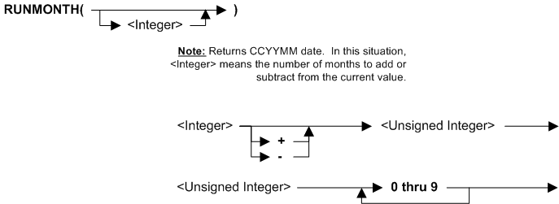

---
layout: default
title: "Function RUNMONTH"
parent: Functions
grand_parent: Workbench Logic Text Full Details
nav_order: 23
---
# Function RUNMONTH
{: .no_toc}
TABLE OF CONTENTS 
1. TOC
{:toc}  

# What is RUNMONTH?

Normally, the date PE runs is the "run date".

The run date can be set to a fixed value in the VDP. See the next section for details of possible values.

RUNMONTH returns a CCYYMM format date based on the run date. All views in a batch use the same base date for RUNMONTH.

# Possible values of the VDP run date

The date that PE runs is the VDP run date unless there is a specific value set in the VDP.  To set a specific value in the VDP see the RUNDATE parameter for the configuration file to MR91 as given in topic [Runbook - MR91 Control File Generator](../../PE Programs/Runbook - MR91 Control File Generator). 

# How do I use RUNMONTH? 

The parameter for RUNMONTH is a number of months to add or delete from the default RUNMONTH. For example, RUNMONTH\(-5\) provides the day five months before the date the view is run.

RUNMONTH can only be used in **Extract Record Filter (ERF)** and **Extract Column Assignment (ECA)** logic text.

# Syntax 

# Rules for the syntax 

RUNMONTH can only be used in **Extract Record Filter (ERF)** and **Extract Column Assignment(ECA)** logic text.

See also topic: [Rules for all Logic Text](../Rules for all Logic Text) 

# Examples: RUNMONTH function in ERF 

|Example logic text|Meaning|
|------------------|-------|
|**IF ({field2} >= RUNMONTH(-1)) &nbsp;&nbsp;&nbsp;&nbsp;THEN SELECT ENDIF**|Select any input records where field2 is the previous month or later, and skip all other records. The example at left assumes that field2 is a month number. The code at left can also be written as: &nbsp;&nbsp;&nbsp;&nbsp;**SELECTIF({field2} >= RUNMONTH(-1))**|

# Examples: RUNMONTH function in ECA 

|Example logic text|Meaning|
|------------------|-------|
|**COLUMN = RUNMONTH()**|Set current column to the same month number as the view is run.|

  
  (Examples can be copied to the clipboard.)
  

