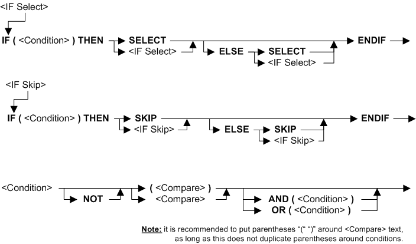
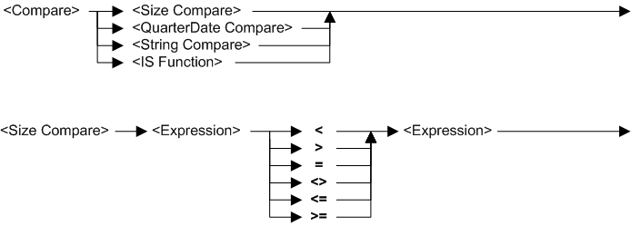
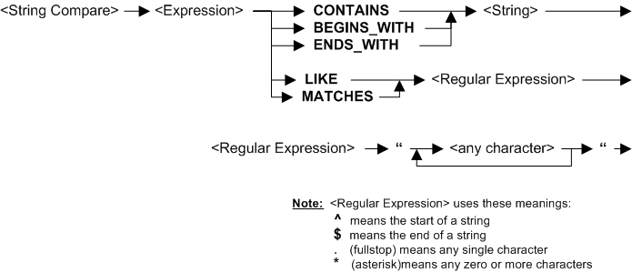
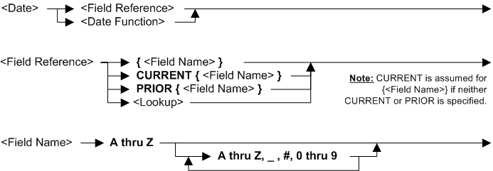

---
layout: default
title: "IF statements (ERF)"
nav_order: 1
parent: IF statements
grand_parent: Workbench Logic Text Full Details
---
# IF statements (ERF)
{: .no_toc}
TABLE OF CONTENTS 
1. TOC
{:toc}  
 

# How do I use IF statements in ERF? 

IF statements can be part of any logic text. An IF statement allows a condition to control if one or more statements are executed.

Even though IF statements are allowed in all logic text, the statements that can be called in an IF statement change depending on the particular logic text.

An IF statement can call another IF statement - this is called "nesting" of IF statements, and is allowed in all logic text.

The syntax details of an IF statement in **Extract Record Filtger** are shown below.

# Syntax 

# Rules for the syntax 

See also topic: [Rules for all Logic Text](../Rules for all Logic Text) 

# Examples: IF with SELECT (ERF)

|Example logic text|Meaning|
|------------------|-------|
|**IF (CURRENT({field1}) &nbsp;&nbsp;&nbsp;&nbsp;<> PRIOR({field1})) &nbsp;&nbsp;&nbsp;&nbsp;THEN SELECT ENDIF**|Select for output records where field1 changes from the previous record. This assumes the input file is sorted into field1 order. This example can also be written: &nbsp;&nbsp;&nbsp;&nbsp;**SELECTIF(CURRENT({field1}) <> PRIOR({field1}))**|
|**IF ({field3} > 1000) &nbsp;&nbsp;&nbsp;&nbsp;THEN SELECT ENDIF**|Select for output only those records with field3 greater than 1000. Skip all other records. This example can also be written: &nbsp;&nbsp;&nbsp;&nbsp;**SELECTIF({field3} > 1000)**|
|**IF ({field2} = 'ABC') &nbsp;&nbsp;&nbsp;&nbsp;THEN SELECT ENDIF**|Select for output only those records with field2 equal to "ABC". Skip all other records. This example can also be written: &nbsp;&nbsp;&nbsp;&nbsp;**SELECTIF({field2} = "ABC")**|
|**IF NOT ({field2} = &nbsp;&nbsp;&nbsp;&nbsp; 'ABC') &nbsp;&nbsp;&nbsp;&nbsp;THEN SELECT ENDIF**|Select for output only those records with  field2 not equal to "ABC". Skip all other records. This example can also be written: &nbsp;&nbsp;&nbsp;&nbsp;**SKIPIF({field2} = "ABC")**|
|**IF ({field2} = "ABC") OR &nbsp;&nbsp;&nbsp;&nbsp;({field2} = "DEF") &nbsp;&nbsp;&nbsp;&nbsp;THEN SELECT ENDIF**|Select for output only those records with field2 equal to "ABC" or "DEF". Skip all other records.|
|**IF ({field2} = "ABC") AND &nbsp;&nbsp;&nbsp;&nbsp;({field3} > 1000) &nbsp;&nbsp;&nbsp;&nbsp;THEN SELECT ENDIF**|Select for output only those records with field2 equal to "ABC" and field3 greater than 1000. Skip all other records.|
|**IF ({field3} + {field4} > &nbsp;&nbsp;&nbsp;&nbsp;{field5} \* 100) &nbsp;&nbsp;&nbsp;&nbsp;THEN SELECT ENDIF**|Select for output only those records with field3 plus field4 is greater than field5 times 100. Skip all other records.|
|**IF NOT ({field1} = ALL("-")) &nbsp;&nbsp;&nbsp;&nbsp;THEN SELECT ENDIF**|Select for output those records with field1 is not equal  to all dashes. Skip all other records. This example gives the same result as: &nbsp;&nbsp;&nbsp;&nbsp;**SKIPIF({field1} = ALL("-"))**|
|**IF NOT ({field7} = &nbsp;&nbsp;&nbsp;&nbsp;REPEAT("-", 13)) &nbsp;&nbsp;&nbsp;&nbsp;THEN SELECT ENDIF**|Select for output those records with field7 is not equal to 13 dashes. This example is the same as: &nbsp;&nbsp;&nbsp;&nbsp;**SKIPIF({field7} = REPEAT("-", 13))**|
|**IF ({field6} = "\xFF") &nbsp;&nbsp;&nbsp;&nbsp;THEN SELECT ENDIF**|Select for output only those records with  field6 equal to hexadecimal FF. Skip all other records.|
|**IF ({field2} = "ABC") AND &nbsp;&nbsp;&nbsp;&nbsp;({field3} > 10) THEN SELECT ELSE IF ({field2} = "DEF") &nbsp;&nbsp;&nbsp;&nbsp;THEN SELECT &nbsp;&nbsp;&nbsp;&nbsp;ELSE IF ({field2} = "GHI") &nbsp;&nbsp;&nbsp;&nbsp;&nbsp;&nbsp;&nbsp;&nbsp;THEN SELECT &nbsp;&nbsp;&nbsp;&nbsp;&nbsp;&nbsp;&nbsp;&nbsp;ENDIF &nbsp;&nbsp;&nbsp;&nbsp;ENDIF ENDIF**|Select for output those records with field2 equal to "ABC" and field3 greater than 10. In addition, select for output those records with field2 equal to "DEF". In addition, select for output those records with field2 equal to "GHI". Skip all other records. Notice that the logic text at left counts as only one IF statement, because the extra IF statements are nested inside the first. The code at left can also be written as below \(note how brackets control the evaluation of the conditions\) **IF ({field2} = "ABC" AND &nbsp;&nbsp;&nbsp;&nbsp;{field3} > 10)&nbsp;&nbsp;&nbsp;&nbsp;&nbsp;&nbsp;&nbsp;&nbsp;&nbsp;&nbsp;&nbsp;&nbsp;&nbsp;OR &nbsp;&nbsp;&nbsp;&nbsp;({field2} = "DEF")&nbsp;&nbsp;&nbsp;&nbsp;&nbsp;&nbsp;OR &nbsp;&nbsp;&nbsp;&nbsp;({field2} = "GHI") &nbsp;&nbsp;&nbsp;&nbsp;THEN SELECT ENDIF**|
|**IF ({field2} = "ABC") AND &nbsp;&nbsp;&nbsp;&nbsp;({field3} > 10) THEN IF ({field4} + {field5} &nbsp;&nbsp;&nbsp;&nbsp;> {field6} &nbsp;&nbsp;&nbsp;&nbsp;THEN SELECT &nbsp;&nbsp;&nbsp;&nbsp;ELSE IF ({field7} = 0") &nbsp;&nbsp;&nbsp;&nbsp;&nbsp;&nbsp;&nbsp;&nbsp;THEN SELECT &nbsp;&nbsp;&nbsp;&nbsp;&nbsp;&nbsp;&nbsp;&nbsp;ENDIF &nbsp;&nbsp;&nbsp;&nbsp;ENDIF ENDIF**|Consider those records with field2 equal to "ABC" and field3 greater than 10.  Of the considered records, select for output those records with field4 plus field5 greater then field6. Of the considered records not yet selected, select also for output those records with field7 equal to zero. Skip all other records. Notice that the logic text at left counts as only one IF statement, because the extra IF statements are nested inside the first. The code at left can also be written as below \(note how brackets control the evaluation of the conditions\) **IF ({field2} = "ABC" AND &nbsp;&nbsp;&nbsp;&nbsp;{field3} > 10)&nbsp;&nbsp;&nbsp;&nbsp;&nbsp;&nbsp;&nbsp;&nbsp;&nbsp;&nbsp;&nbsp;&nbsp;&nbsp;AND &nbsp;&nbsp;&nbsp;&nbsp;(({field4} + {field5} &nbsp;&nbsp;&nbsp;&nbsp;&nbsp;&nbsp;> {field6})&nbsp;&nbsp;&nbsp;&nbsp;OR &nbsp;&nbsp;&nbsp;&nbsp;({field7} = 0)) &nbsp;&nbsp;&nbsp;&nbsp;THEN SELECT ENDIF**|
|**IF ISFOUND({Lookup3}) &nbsp;&nbsp;&nbsp;&nbsp;THEN SELECT ENDIF**|Select all input records where lookup path Lookup3 successfully finds a target record, and skip all other records. This example is the same as: &nbsp;&nbsp;&nbsp;&nbsp;**SELECTIF(ISFOUND({Lookup3}))**|
|**IF ISFOUND({Lookup3,field7}) &nbsp;&nbsp;&nbsp;&nbsp;THEN SELECT ENDIF**|Select all input records where lookup path Lookup3 successfully finds a target record using effective date of field7, and skip all other records. This example is the same as: &nbsp;&nbsp;&nbsp;&nbsp;**SELECTIF(ISFOUND({Lookup3,field7}))**|
|**IF ISFOUND({Lookup3;$SYM="A"}) &nbsp;&nbsp;&nbsp;&nbsp;THEN SELECT ENDIF**|Select all input records where lookup path Lookup3 successfully finds a target record using symbol SYM set to "A", and skip all other records. This example is the same as: &nbsp;&nbsp;&nbsp;&nbsp;**SELECTIF(ISFOUND({Lookup3;$SYM="A"}))**|
|**IF ISFOUND({Lookup3, &nbsp;&nbsp;&nbsp;&nbsp;&nbsp;&nbsp;&nbsp;&nbsp;&nbsp;&nbsp;&nbsp;&nbsp;field7;$SYM1=3,$SYM2=0}) &nbsp;&nbsp;&nbsp;&nbsp;THEN SELECT ENDIF**|Select all input records where lookup path Lookup3 successfully finds a target record using effective date of field7 and symbol SYM1 set to 3 and symbol SYM2 set to zero. Skip all other records. This example is the same as: &nbsp;&nbsp;&nbsp;&nbsp;**SELECTIF(ISFOUND({Lookup3, &nbsp;&nbsp;&nbsp;&nbsp;&nbsp;&nbsp;&nbsp;&nbsp;field7;$SYM1=3,$SYM2=0}))**|

# Examples: IF with SKIP (ERF)

|Example logic text|Meaning|
|------------------|-------|
|**IF (CURRENT({field1}) &nbsp;&nbsp;&nbsp;&nbsp;= PRIOR({field1})) &nbsp;&nbsp;&nbsp;&nbsp;THEN SKIP ENDIF**|Skip records where field1 is the same as the previous record. This assumes the input file is sorted into field1 order. This example can also be written: &nbsp;&nbsp;&nbsp;&nbsp;**SKIPIF(CURRENT({field1}) = PRIOR({field1}))**|
|**IF ({field3} > 1000) &nbsp;&nbsp;&nbsp;&nbsp;THEN SKIP ENDIF**|Skip for output those records with field3 greater than 1000. Select all other records. This example can also be written: &nbsp;&nbsp;&nbsp;&nbsp;**SKIPIF({field3} > 1000)**|
|**IF ({field2} = 'ABC') &nbsp;&nbsp;&nbsp;&nbsp;THEN SKIP ENDIF**|Skip for output those records with field2 equal to "ABC". Select all other records. This example can also be written: &nbsp;&nbsp;&nbsp;&nbsp;**SKIPIF({field2} = "ABC")**|
|**IF NOT ({field2} = 'ABC') &nbsp;&nbsp;&nbsp;&nbsp;THEN SKIP ENDIF**|Skip for output those records with field2 not equal to "ABC". Select all other records. This example can also be written: &nbsp;&nbsp;&nbsp;&nbsp;**SELECTIF({field2} = "ABC")**|
|**IF ({field2} = "A") OR &nbsp;&nbsp;&nbsp;&nbsp;({field2} = "D") &nbsp;&nbsp;&nbsp;&nbsp;THEN SKIP ENDIF**|Skip for output those records with field2 equal to "A" or "D". Select all other records.|
|**IF ({field2} = "A") AND &nbsp;&nbsp;&nbsp;&nbsp;({field3} > 10) &nbsp;&nbsp;&nbsp;&nbsp;THEN SKIP ENDIF**|Skip for output those records with field2 equal to "A" and field3 greater than 10. Select all other records.|
|**IF ({field3} + {field4} > &nbsp;&nbsp;&nbsp;&nbsp;{field5} \* 100) &nbsp;&nbsp;&nbsp;&nbsp;THEN SKIP ENDIF**|Skip for output those records with field3 plus field4 greater than field5 times 100. Select all other records.|
|**IF ({field2} = ALL("-")) &nbsp;&nbsp;&nbsp;&nbsp;THEN SKIP ENDIF**|Skip for output those records with field2 is equal to all dashes.  Select all other records. This example gives the same result as: &nbsp;&nbsp;&nbsp;&nbsp;**SKIPIF({field2} = ALL("-"))**|
|**IF ({field8} = &nbsp;&nbsp;&nbsp;&nbsp;REPEAT("-", 13)) &nbsp;&nbsp;&nbsp;&nbsp;THEN SKIP ENDIF**|Skip for output those records with field8 is equal to 13 dashes. Select all other records. This example is the same as: &nbsp;&nbsp;&nbsp;&nbsp;**SKIPIF({field8} = REPEAT("-", 13))**|
|**IF ({field6} = "\xFF") &nbsp;&nbsp;&nbsp;&nbsp;THEN SKIP ENDIF**|Skip for output those records with field6 equal to hexadecimal FF. Select all other records. This example is the same as: &nbsp;&nbsp;&nbsp;&nbsp;**SKIPIF({field6} = "\xFF")**|
|**IF ({field2} = "A") AND &nbsp;&nbsp;&nbsp;&nbsp;({field3} > 10) THEN SKIP ELSE IF ({field2} = "D") &nbsp;&nbsp;&nbsp;&nbsp;THEN SKIP &nbsp;&nbsp;&nbsp;&nbsp;ELSE IF ({field2} = "G") &nbsp;&nbsp;&nbsp;&nbsp;&nbsp;&nbsp;&nbsp;&nbsp;THEN SKIP &nbsp;&nbsp;&nbsp;&nbsp;&nbsp;&nbsp;&nbsp;&nbsp;ENDIF &nbsp;&nbsp;&nbsp;&nbsp;ENDIF ENDIF**|Skip for output those records with field2 equal to "A" and field3 greater than 10. In addition, skip for output those records with field2 equal to "D". In addition, skip for output those records with field2 equal to "G". Select all other records. Notice that the logic text at left counts as only one IF statement, because the extra IF statements are nested inside the first. The code at left can also be written as below \(note how brackets control the evaluation of the conditions\) **IF ({field2} = "A" AND &nbsp;&nbsp;&nbsp;&nbsp;{field3} > 10)&nbsp;&nbsp;&nbsp;&nbsp;&nbsp;&nbsp;&nbsp;&nbsp;&nbsp;OR &nbsp;&nbsp;&nbsp;&nbsp;({field2} = "D")&nbsp;&nbsp;&nbsp;&nbsp;&nbsp;&nbsp;OR &nbsp;&nbsp;&nbsp;&nbsp;({field2} = "G") &nbsp;&nbsp;&nbsp;&nbsp;THEN SKIP ENDIF**|
|**IF ISNOTFOUND({Lockup4}) &nbsp;&nbsp;&nbsp;&nbsp;THEN SKIP ENDIF**|Skip all input records where lookup path Lockup4 does not successfully find a target record, and select all other records. This example is the same as: &nbsp;&nbsp;&nbsp;&nbsp;**SKIPIF(ISNOTFOUND({Lockup4}))**|
|**IF ISNOTFOUND({Lockup4,field7}) &nbsp;&nbsp;&nbsp;&nbsp;THEN SKIP ENDIF**|Skip all input records where lookup path Lockup4 does not successfully find a target record using effective date of field7, and select all other records. This example is the same as: &nbsp;&nbsp;&nbsp;&nbsp;**SKIPIF(ISNOTFOUND({Lockup4,field7}))**|
|**IF ISNOTFOUND({Lockup4;$SYM="A"}) &nbsp;&nbsp;&nbsp;&nbsp;THEN SKIP ENDIF**|Skip all input records where lookup path Lockup4 does not successfully find a target record using symbol SYM set to "A", and select all other records. This example is the same as: &nbsp;&nbsp;&nbsp;&nbsp;**SKIPIF(ISNOTFOUND({Lockup4;$SYM="A"}))**|
|**IF ISNOTFOUND({Lockup4, &nbsp;&nbsp;&nbsp;&nbsp;&nbsp;&nbsp;&nbsp;&nbsp;&nbsp;&nbsp;&nbsp;&nbsp;field7;$SYM1=3,$SYM2=0}) &nbsp;&nbsp;&nbsp;&nbsp;THEN SKIP ENDIF**|Skip all input records where lookup path Lockup4 does not successfully find a target record using effective date of field7 and symbol SYM1 set to 3 and symbol SYM2 set to zero. Select all other records. This example is the same as: &nbsp;&nbsp;&nbsp;&nbsp;**SKIPIF(ISNOTFOUND({Lockup4, &nbsp;&nbsp;&nbsp;&nbsp;&nbsp;&nbsp;&nbsp;&nbsp;field7;$SYM1=3,$SYM2=0}))**|

  
  (Examples can be copied to the clipboard.)
  

